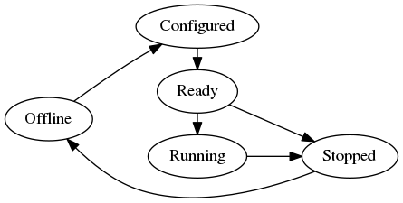

# Remoteproc Design Document
## Remoteproc LCM States

### State Transition
| State Transition | Transition Trigger |
|:-----------------|:-------------------|
| Offline -> Ready | load firmware ; `remoteproc_load_fw(&rproc, fw, &loader)` |
| Ready -> Running | start the processor;  `remoteproc_start(&rproc)` |
| Ready -> Stopped | stop the processor;  `remoteproc_stop(&rproc)`;  `remoteproc_shutdown(&rproc)` |
| Running -> Error | remote error has been detected;  `remoteproc_error_cb(&rproc)` |
| Running -> Stopped | stop the processor;  `remoteproc_stop(&rproc)`;  `remoteproc_shutdown(&rproc)` |
| Runinng -> Suspended | suspend the processor;  `remoteproc_suspend(&rproc, suspend_level)`|
| Suspended -> Running | wakeup callback is called from the remoteproc instance;  `remoteproc_wakenup_cb(&rproc)` |
| Suspended -> Stopped | stop the processor;  `remoteproc_stop(&rproc)`;  `remoteproc_shutdown(&rproc)` |
| Error -> Stopped |stop the processor;  `remoteproc_stop(&rproc)`;  `remoteproc_shutdown(&rproc)` |
| Stopped -> Offline | shutdown the processor; `remoteproc_shutdown(&rproc)` |

###

