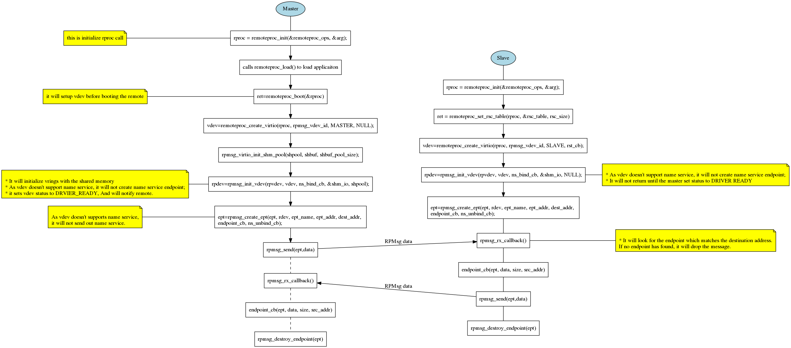

# RPMsg Design Document
## RPMsg User API Flow Chats
### RPMsg Static Endpoint

### Binding Endpoint Dynamically with Name Service

### Creating Endpoint Dynamically with Name Service

## RPMsg User APIs
* `struct virtio_dev *rproc_get_vdev_by_id(struct remoteproc *rproc,
  unsigned int virtio_id)`
  * get virtio device from remote proc vdevs list with specified virtio dev id.
* `int rpmsg_init_vdev(struct virtio_dev *vdev, void *shm,
    struct metal_io_region *shm_io, size_t buffer_size)`
  * Initialize virtio device, if vdev supports name service, it will create
    name service endpoint. If vdev is the master, it will set the status to
    DRIVER_READY and will notify the remote.
* `struct rpmsg_endpoint* rpmsg_create_endpoint(struct rpmsg_device *rpdev,
   uint32_t ep_addr, uint32_t dest_addr, rx_cb, destroy_cb, void *priv)`
  * create RPMsg endpoint.
* `void rpmsg_destroy_ept(struct rpmsg_endpoint *)`
  * destroy RPMsg endpoint.
* `int rpmsg_send(struct rpmsg_endpoint *ept, void *data, uint32_t len)`
  * send data with RPMsg endpoint.
* `int rpmsg_sendto(struct rpmsg_endpoint *ept, void *data, uint32_t len,
  uint32_t dst)`
  * send data to a specific destination.
* `int rpmsg_send_offchannel(struct rpmsg_endpoint *ept, void *data,
  uint32_t len, uint32_t dst, uint32_t src)`
  * send data to a specific destination with specific source addr
* `int rpmsg_trysend(struct rpmsg_endpoint *ept, void *data, uint32_t len)`
  * try to send data, return if it fails.
* `int rpmsg_trysendto(struct rpmsg_endpoint *ept, void *data, uint32_t len,
  uint32_t dst)`
  * try to send data to a specific destination, return if it fails.
* `int rpmsg_trysend_offchannel(struct rpmsg_endpoint *ept, void *data,
  uint32_t len, uint32_t dst, uint32_t src)`
  * try to send data to a specific destination with specific source addr return
    if it fails.
